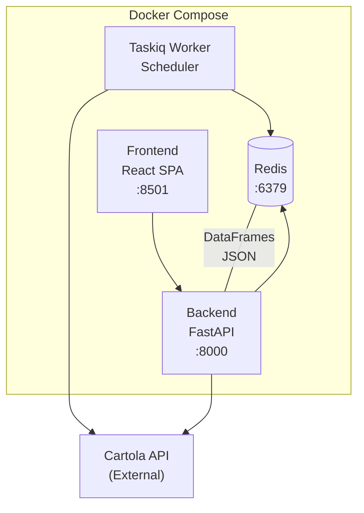

# CartolaPy

A full-stack application for visualizing and analyzing data from the Cartola FC fantasy football API.

## Tech Stack

**Backend**: FastAPI + Redis + Taskiq  
**Frontend**: React + Vite

## Prerequisites

- Python 3.10+
- Node.js 18+
- Docker (for Redis)

## Quick Start

```bash
# 1. Clone the repo
git clone https://github.com/tuliosouza99/CartolaPy.git
cd CartolaPy

# 2. Setup environment variables
cp .env.example .env
# Generate keys: python -c "import secrets; print(secrets.token_hex(32))"
# Edit .env and fill in REDIS_PASSWORD, API_KEY, ADMIN_API_KEY

# 3. Start all services
docker compose up -d --build
```

Open http://localhost:8501 in your browser.

### Running Services
```bash
docker compose up -d --build   # Start all services (redis, backend, frontend, taskiq)
docker compose down            # Stop all services
docker compose logs -f         # View logs
```

## Project Structure

```
backend/
├── main.py              # FastAPI app factory (get_app())
├── lifespan.py          # Startup/shutdown handlers
├── dependencies.py      # FastAPI DI
├── tkq.py               # Taskiq broker
├── tkq_sched.py         # Taskiq scheduler
├── tasks.py             # Background tasks
├── api/
│   ├── routes.py        # REST endpoints
│   └── models.py        # Pydantic models
└── services/
    ├── atletas_unified.py
    ├── pontos_cedidos_unified.py
    ├── enums.py         # Scout enum, data paths
    ├── redis_store.py
    ├── request_handler.py
    └── data_loaders/    # Data loading from Redis

frontend/
├── src/
│   ├── App.jsx          # Main app with routing
│   ├── pages/           # Page components
│   │   ├── AtletasUnified.jsx
│   │   ├── PontosCedidosUnified.jsx
│   │   └── ...
│   └── components/      # Reusable components
│       ├── TableView.jsx
│       ├── FilterSidebar.jsx
│       ├── RoundIntervalSlider.jsx
│       ├── Navbar.jsx
│       └── ...
├── package.json
└── vite.config.js

tests/                   # Pytest suite
├── conftest.py          # Shared fixtures
├── test_api_routes.py
└── ... (other test files)
```

## Available Scripts

### Backend
```bash
cd backend
ruff check .                    # Lint entire project
ruff format --check .           # Check formatting
ruff check --fix . && ruff format .  # Auto-fix lint and format

pytest                          # Run all tests
pytest tests/test_api_routes.py # Single file
pytest -k "pattern"             # Matching pattern
pytest -v                       # Verbose output
pytest --cov=backend            # With coverage
```

### Frontend
```bash
cd frontend
npm install
npm run dev      # Dev server (port 5173)
npm run build    # Production build
npm run preview  # Preview production build
```

## Features

- **AtletasUnified**: View player statistics with filters for position, club, status, and price range
- **PontosCedidosUnified**: View points ceded by each team for specific positions
- **Confrontos**: Match predictions and analysis
- **Dicas da Rodada**: AI-generated next-round report with streamed execution, Redis caching, local JSON history, and agent-selected analysis windows (last 5 and 10 are recommended starting points)
- **Pontuacoes**: Round-by-round scoring data
- Filter by round range, home/away conditions
- Sort and paginate results
- Dark/light theme toggle
- URL-based filter state (shareable/bookmarkable links)

## Environment Variables

Copy `.env.example` to `.env` and configure:
- `REDIS_PASSWORD` - Redis password
- `API_KEY` - API authentication key
- `ADMIN_API_KEY` - Admin authentication key
- `OPENAI_API_KEY` - Required for generating "Dicas da Rodada"
- `TAVILY_API_KEY` - Optional, enables odds/news search in "Dicas da Rodada"
- `DICAS_MODEL` - Optional Deep Agents model string, defaults to `openai:gpt-5.5`
- `DICAS_REASONING_EFFORT` - Optional OpenAI reasoning effort for Dicas generation, defaults to `medium`
- `CARTOLAPY_API_BASE_URL` - Backend URL used by the report worker, defaults locally to `http://localhost:8000`
- `DICAS_REPORTS_DIR` - Optional directory for saved "Dicas da Rodada" JSON reports, defaults to `data/dicas_reports`
- `LANGSMITH_TRACING`, `LANGSMITH_API_KEY`, `LANGSMITH_PROJECT` - Optional tracing for the report agent
- `ENVIRONMENT=production` for Docker deployment
- `ENVIRONMENT=pytest` for test mode

Generate secure keys:
```bash
python -c "import secrets; print(secrets.token_hex(32))"
```

## Architecture



### Services

| Service | Port | Description |
|---------|------|-------------|
| Redis | 6379 | Data cache & storage |
| Backend | 8000 | FastAPI REST API |
| Frontend | 8501 | React SPA (nginx) |
| Taskiq Worker | - | Background task processing |
| Taskiq Scheduler | - | Task scheduling |

### Data Flow

1. **Taskiq** fetches data from Cartola API and stores in Redis
2. **Backend** reads from Redis, computes unified views, serves REST API
3. **Frontend** consumes REST API, displays data with filters/sorting

## API Endpoints

### Tables
- `GET /api/tables/atletas` - Player data
- `GET /api/tables/atletas-unified` - Player data with filters (rodada, club, position, status, price)
- `GET /api/tables/atletas/{atleta_id}/historico` - Player round-by-round history
- `GET /api/tables/pontos-cedidos` - Points ceded data
- `GET /api/tables/pontos-cedidos-unified` - Points ceded with filters
- `GET /api/tables/pontos-cedidos-unified/{clube_id}/matches` - Club's matches with ceded points
- `GET /api/tables/confrontos` - Match data
- `GET /api/tables/pontuacoes` - Round scoring data
- `GET /api/dicas-da-rodada` - Cached AI report status for the next round
- `POST /api/dicas-da-rodada/generate` - Start report generation when no cached report exists
- `POST /api/dicas-da-rodada/regenerate` - Regenerate a completed report
- `GET /api/dicas-da-rodada/eval` - Check saved recommendation logic against completed rounds by position
- `GET /api/dicas-da-rodada/history` - List locally saved AI reports
- `GET /api/dicas-da-rodada/history/{report_id}` - Load a locally saved AI report
- `GET /api/dicas-da-rodada/runs/{run_id}/stream` - Server-sent generation progress stream
- `GET /api/tables/status` - Current round & last updated timestamps
- `GET /api/tables/filter-options` - Available clubs, positions, status for filtering

### Games
- `GET /api/partidas/{rodada}` - Matches for a round
- `GET /api/confrontos/{rodada}` - Match details with player scores
- `GET /api/proximo-jogo/{clube_id}` - Next match for a club

### Admin
- `POST /api/update/atletas` - Trigger data refresh (requires `API_KEY`)
- `GET /api/redis/all` - View all Redis data (requires `ADMIN_API_KEY`)
